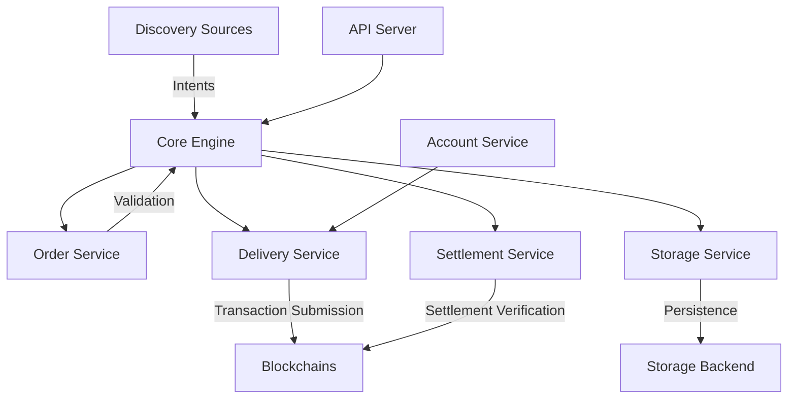

# OIF Solver - Technical Architecture & Implementation Analysis

## Executive Summary

The OIF Solver is a high-performance, modular cross-chain transaction executor built in Rust. It implements the EIP-7683 Cross-Chain Intents Standard to enable seamless asset transfers and contract interactions across different blockchain networks. The system discovers intents, validates them into orders, executes fills on destination chains, and manages settlement with claim processing.

## Core Architecture

### System Overview



### Component Hierarchy

The project follows a workspace structure with 10 specialized crates:

```
oif-solver/
├── solver-types        # Shared data structures & interfaces
├── solver-config       # Configuration management
├── solver-core         # Orchestration engine & event bus
├── solver-storage      # Persistence layer abstraction
├── solver-account      # Key management & signing
├── solver-discovery    # Intent discovery mechanisms
├── solver-order        # Order validation & strategy
├── solver-delivery     # Transaction submission & monitoring
├── solver-settlement   # Fill validation & claim management
└── solver-service      # Main binary & API server
```

## Data Flow & Lifecycle

### 1. Intent Discovery & Validation

```
Discovery → Intent → Validation → Order → Storage
```

**Key Files:**

- `solver-discovery/src/implementations/onchain/_7683.rs` - On-chain event monitoring
- `solver-discovery/src/implementations/offchain/_7683.rs` - Off-chain API discovery
- `solver-core/src/handlers/intent.rs` - Intent processing handler

**Process:**

1. Discovery services monitor blockchain events (Open event) or API endpoints
2. Raw intents are constructed with metadata (source, standard, timestamp)
3. IntentHandler validates and converts intents to Orders
4. Orders are stored with initial status "Created"

### 2. Order Execution Flow

```
Order → ExecutionStrategy → Fill Transaction → Delivery
```

**Key Files:**

- `solver-order/src/implementations/standards/_7683.rs` - EIP-7683 order implementation
- `solver-order/src/implementations/strategies/simple.rs` - Execution strategy
- `solver-core/src/handlers/order.rs` - Order execution handler

**Process:**

1. Execution strategy evaluates order profitability
2. For off-chain orders: Generate `openFor()` transaction (prepare phase)
3. Generate fill transaction with proper calldata
4. Submit through delivery service to destination chain

### 3. Settlement & Claiming

```
Fill Confirmation → Settlement Validation → Claim Generation → Reward Collection
```

**Key Files:**

- `solver-settlement/src/implementations/direct.rs` - Settlement implementation
- `solver-core/src/handlers/settlement.rs` - Settlement handler
- `solver-core/src/handlers/transaction.rs` - Transaction monitoring

**Process:**

1. Monitor fill transaction confirmation
2. Validate fill through settlement service
3. Generate proof with attestation data
4. Submit claim transaction after dispute period
5. Collect rewards on origin chain

## Core Data Structures

### Intent

```rust
struct Intent {
    id: String,                    // Unique identifier
    source: String,                 // "on-chain" or "off-chain"
    standard: String,               // "eip7683"
    metadata: IntentMetadata,       // Discovery metadata
    data: serde_json::Value,       // Raw intent data
    quote_id: Option<String>,      // Associated quote
}
```

### Order

```rust
struct Order {
    id: String,                    // Order identifier
    standard: String,              // Protocol standard
    status: OrderStatus,           // Lifecycle state
    data: Eip7683OrderData,       // Standard-specific data
    execution_params: Option<ExecutionParams>,
    fill_tx_hash: Option<TransactionHash>,
    fill_proof: Option<FillProof>,
}
```

### Order Lifecycle States

```
Created → Pending → Executed → Settled → Finalized
                 ↘ Failed(TransactionType)
```

## Event-Driven Architecture

### Event Bus System

The solver uses an internal event bus for loose coupling between services:

**Event Types:**

- `DiscoveryEvent`: Intent discovered, validated, rejected
- `OrderEvent`: Preparing, executing, skipped, deferred
- `DeliveryEvent`: Transaction pending, confirmed, failed
- `SettlementEvent`: Fill detected, proof ready, claim ready, completed

**Key Files:**

- `solver-core/src/engine/event_bus.rs` - Event bus implementation
- `solver-types/src/events.rs` - Event type definitions

### Event Flow Example

```
1. Discovery emits IntentDiscovered
2. Core validates → emits IntentValidated
3. Order service → emits OrderExecuting
4. Delivery submits → emits TransactionPending
5. Monitor confirms → emits TransactionConfirmed
6. Settlement validates → emits ClaimReady
7. Claim submitted → emits Completed
```

## Configuration System

### Configuration Structure (TOML)

```toml
[solver]
id = "solver-instance-id"
monitoring_timeout_minutes = 5

[storage]
backend = "memory" | "file"
config = { storage_path = "./data" }

[account]
provider = "local"
config = { private_key = "0x..." }

[delivery.providers.{chain_name}]
rpc_url = "http://..."
chain_id = 31337
private_key = "0x..."

[discovery.sources.{source_name}]
# Source-specific configuration

[order.implementations.{standard}]
# Standard-specific configuration

[settlement.implementations.{standard}]
# Settlement configuration
```

### Dynamic Factory Pattern

The system uses factory functions to instantiate components based on configuration:

**Key Files:**

- `solver-service/src/main.rs` - Factory registration
- `solver-core/src/builder/mod.rs` - Builder pattern implementation

## Contract Interactions

### EIP-7683 Contract Calls

**InputSettlerEscrow (Origin Chain):**

- `open(order)` - Create on-chain order
- `openFor(order, sponsor, signature)` - Create sponsored order
- `finalise(order, timestamps, solvers, destination, call)` - Claim rewards

**OutputSettler (Destination Chain):**

- `fill(orderId, originData, fillerData)` - Execute order fill

### Transaction Generation

**Key Files:**

- `solver-order/src/implementations/standards/_7683.rs` - Transaction builders

The system uses Alloy's sol! macro for type-safe contract interactions:

```rust
sol! {
    interface IDestinationSettler {
        function fill(bytes32 orderId, bytes originData, bytes fillerData) external;
    }
}
```

## Storage Layer

### Storage Abstraction

**Namespaces:**

- `orders` - Order state
- `intents` - Raw intent data
- `quotes` - Quote commitments
- `monitoring` - Transaction monitoring

**Backends:**

- Memory: In-memory HashMap with TTL
- File: JSON files with directory structure

**Key Files:**

- `solver-storage/src/lib.rs` - Storage service
- `solver-storage/src/implementations/memory.rs` - Memory backend
- `solver-storage/src/implementations/file.rs` - File backend

## API Endpoints

### REST API Structure

**Quote Endpoint** (`POST /quote`):

- Input: Available assets, requested outputs
- Output: Quote with settlement data, fees, ETA
- Caches quotes for subsequent order submission

**Order Endpoints**:

- `POST /order` - Submit new order
- `GET /order/{id}` - Get order status
- `GET /orders` - List orders

**Key Files:**

- `solver-service/src/apis/quote.rs` - Quote logic
- `solver-service/src/apis/order.rs` - Order management
- `solver-service/src/server.rs` - HTTP server

## Demo System

### Setup Script Flow (`setup_local_anvil.sh`)

1. **Chain Initialization:**

   - Start Anvil on ports 8545 (origin) and 8546 (destination)
   - Chain IDs: 31337 and 31338

2. **Contract Deployment:**

   - TestToken contracts on both chains
   - InputSettlerEscrow on origin
   - OutputSettler on destination
   - Mock Oracle for attestations

3. **Account Setup:**

   - Fund solver, user, and recipient accounts
   - Approve token spending for settlers

4. **Configuration Generation:**
   - Creates `config/demo.toml` with deployed addresses
   - Configures discovery, delivery, and settlement

### Intent Submission (`send_onchain_intent.sh`)

1. Check balances across chains
2. Create StandardOrder with cross-chain parameters
3. Submit to InputSettlerEscrow.open()
4. Monitor solver processing
5. Verify balance changes

## Critical Implementation Details

### Duplicate Prevention

The system prevents duplicate processing when both on-chain and off-chain discovery are active:

```rust
// solver-core/src/handlers/intent.rs:62-75
let exists = self.storage.exists(StorageKey::Intents.as_str(), &intent.id).await?;
if exists {
    return Ok(());  // Skip duplicate
}
```

### State Machine Validation

Order state transitions are strictly validated:

```rust
// solver-core/src/state/order.rs:96-120
Created → Pending → Executed → Settled → Finalized
```

### Gas Optimization

Claim operations are batched:

```rust
// solver-core/src/engine/mod.rs:67
static CLAIM_BATCH: usize = 1;  // Configurable batching
```

### Monitoring Timeout

Transactions are monitored with configurable timeout:

```rust
// Default: 480 minutes (8 hours)
monitoring_timeout_minutes = 480
```

## Security Considerations

1. **Private Key Management**: Local provider stores keys in memory
2. **Signature Validation**: Off-chain orders require Permit2Witness signatures
3. **Dispute Period**: Configurable delay before claims (default: 1 second in demo)
4. **Oracle Attestation**: Fill validation through trusted oracle
5. **Nonce Management**: Prevents replay attacks

## Performance Characteristics

- **Discovery**: Continuous polling with backoff
- **Execution**: Parallel transaction submission
- **Storage**: In-memory for speed, file for persistence
- **Monitoring**: Async transaction tracking with timeout
- **API**: Sub-100ms quote response target

## Extension Points

### Adding New Standards

1. Implement `OrderInterface` trait
2. Add discovery source
3. Register factory in main.rs
4. Update configuration schema

### Adding Storage Backends

1. Implement `StorageInterface` trait
2. Add factory function
3. Register in builder

### Custom Execution Strategies

1. Implement `ExecutionStrategy` trait
2. Add configuration schema
3. Register factory

## Key Directories & Files

### Core Logic

- `solver-core/src/engine/mod.rs` - Main orchestration loop
- `solver-core/src/handlers/` - Event handlers
- `solver-core/src/state/order.rs` - State machine

### Contract Interfaces

- `solver-order/src/implementations/standards/_7683.rs` - EIP-7683 implementation
- `solver-types/src/standards/eip7683.rs` - Data structures

### Configuration

- `config/demo.toml` - Demo configuration
- `config/example.toml` - Template configuration

### Scripts

- `scripts/demo/setup_local_anvil.sh` - Environment setup
- `scripts/demo/send_onchain_intent.sh` - Test intent submission

## Testing & Development

### Running the Demo

```bash
# 1. Setup environment
./scripts/demo/setup_local_anvil.sh

# 2. Start solver
cargo run --bin solver -- --config config/demo.toml

# 3. Send test intent
./scripts/demo/send_onchain_intent.sh
```

### Logging

```bash
# Debug specific modules
RUST_LOG=solver_core=debug,solver_delivery=info cargo run

# Trace everything
RUST_LOG=trace cargo run
```

## Future Enhancements

1. **Multi-Standard Support**: Beyond EIP-7683
2. **Advanced Strategies**: MEV protection, limit orders
3. **Distributed Storage**: Redis/PostgreSQL backends
4. **Oracle Network**: Decentralized attestation
5. **Performance**: Connection pooling, caching layers
6. **Monitoring**: Prometheus metrics, OpenTelemetry

## Conclusion

The OIF Solver demonstrates a production-ready architecture for cross-chain intent execution with:

- Clean separation of concerns through modular crates
- Event-driven communication for loose coupling
- Pluggable implementations via factory pattern
- Comprehensive state management and persistence
- Robust error handling and monitoring

The system is designed for extensibility, allowing new standards, strategies, and backends to be added without modifying core logic.
