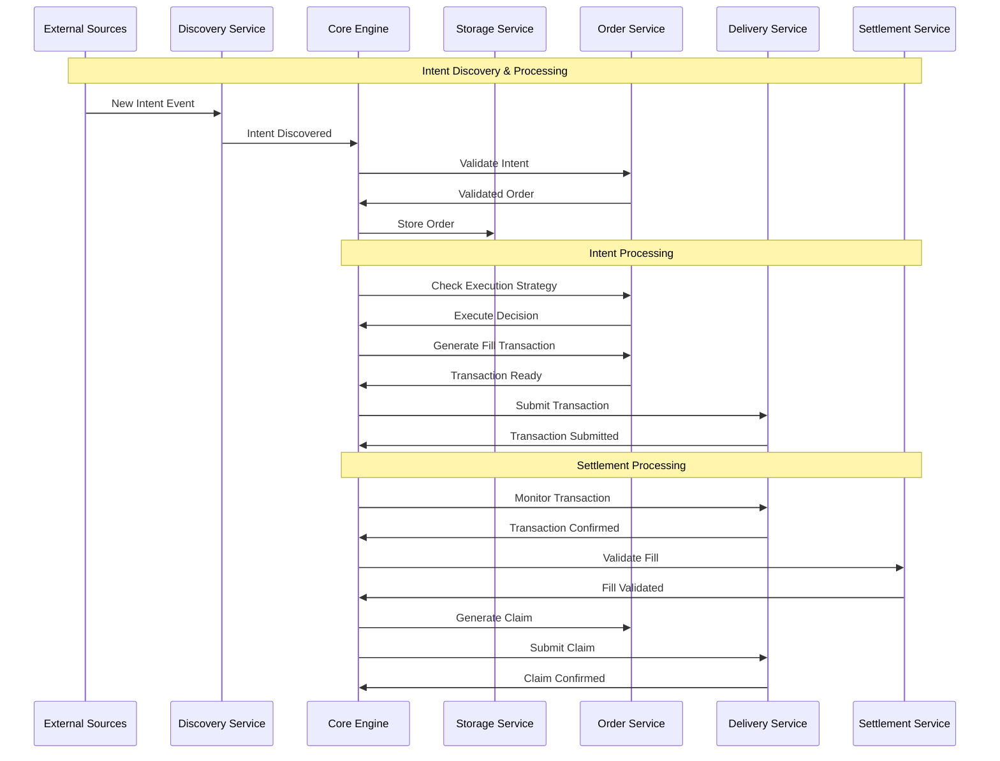

# OIF Solver

A high-performance cross-chain solver implementation for the Open Intents Framework (OIF). This solver enables efficient cross-chain order execution by discovering intents, finding optimal execution paths, and settling transactions across multiple blockchain networks.

## Overview

The OIF Solver is designed to:

- Discover and monitor cross-chain intents from multiple sources
- Find optimal execution paths across different chains and liquidity sources
- Execute transactions efficiently while minimizing costs
- Provide comprehensive monitoring and observability
- Support multiple order types and protocols (currently EIP-7683)

## High-Level Architecture



## Architecture

The solver is built as a modular Rust workspace with clearly defined service boundaries:

### Core Components

- **solver-core**: Orchestrates the entire solver workflow and coordinates between services
- **solver-types**: Defines shared data structures, traits, and interfaces used across all components
- **solver-config**: Handles configuration loading and validation
- **solver-storage**: Provides persistent storage abstraction with TTL management for solver state
- **solver-account**: Manages cryptographic keys and signing operations

### Service Components

- **solver-discovery**: Discovers new intents/orders from various blockchain and off-chain sources
- **solver-order**: Validates intents, manages execution strategies, and generates transactions
- **solver-delivery**: Handles transaction preparation, submission, and monitoring across multiple chains
- **solver-settlement**: Manages settlement verification and claim processing after transaction execution

### Binary

- **solver-service**: Main executable that wires up all components and runs the solver

## Project Structure

```
oif-solver/
├── Cargo.toml                   # Workspace definition
├── crates/                      # Modular components
│   ├── solver-account/          # Cryptographic operations
│   ├── solver-config/           # Configuration management
│   ├── solver-core/             # Orchestration engine
│   ├── solver-delivery/         # Transaction submission
│   ├── solver-discovery/        # Intent monitoring
│   ├── solver-order/            # Order processing
│   ├── solver-service/          # Main executable
│   ├── solver-settlement/       # Settlement verification
│   ├── solver-storage/          # State persistence
│   └── solver-types/            # Shared types
├── config/                      # Configuration examples
└── scripts/                     # Deployment and demo scripts
```

## Component Responsibilities

### solver-core

- Orchestrates the entire order lifecycle
- Manages event-driven communication between services
- Implements the main solver loop
- Handles graceful shutdown
- Provides factory pattern for building solver instances

### solver-discovery

- Monitors blockchain events for new intents
- Supports multiple discovery sources simultaneously
- Filters and validates discovered intents
- Pushes valid intents to the core engine

### solver-order

- Validates intents and converts them to orders
- Implements execution strategies (when to execute)
- Generates fill and claim transactions
- Manages order-specific logic for different protocols

### solver-delivery

- Submits transactions to multiple blockchains
- Monitors transaction confirmation status
- Manages gas estimation and pricing
- Handles transaction retries and failures

### solver-settlement

- Validates fill transactions
- Extracts and stores fill proofs
- Monitors when orders can be claimed
- Manages dispute periods and oracle interactions

### solver-storage

- Provides persistent storage for orders and state
- Implements TTL (time-to-live) for temporary data
- Supports different storage backends
- Ensures data consistency across services

### solver-account

- Manages private keys and signing operations
- Supports different key management backends
- Provides secure signing for transactions
- Handles address derivation

## Quick Start

```bash
# Build the project
cargo build

# Run tests
cargo test

# Run the solver service with info logs
cargo run -- --config config/example.toml

# Run with debug logs for solver modules only
RUST_LOG=solver_core=debug,solver_delivery=debug,info cargo run -- --config config/example.toml
```

## Configuration

The solver uses TOML configuration files. See `config/example.toml` for a complete example:

```toml
# Solver identity and settings
[solver]
id = "oif-solver-local"
monitoring_timeout_minutes = 5

# Networks configuration - defines supported chains and tokens
[networks.31337]  # Origin chain
input_settler_address = "0x9fE46736679d2D9a65F0992F2272dE9f3c7fa6e0"
output_settler_address = "0xCf7Ed3AccA5a467e9e704C703E8D87F634fB0Fc9"
[[networks.31337.tokens]]
address = "0x5FbDB2315678afecb367f032d93F642f64180aa3"
symbol = "TOKA"
decimals = 18
[[networks.31337.tokens]]
address = "0xe7f1725E7734CE288F8367e1Bb143E90bb3F0512"
symbol = "TOKB"
decimals = 18

[networks.31338]  # Destination chain
input_settler_address = "0x9fE46736679d2D9a65F0992F2272dE9f3c7fa6e0"
output_settler_address = "0xCf7Ed3AccA5a467e9e704C703E8D87F634fB0Fc9"
[[networks.31338.tokens]]
address = "0x5FbDB2315678afecb367f032d93F642f64180aa3"
symbol = "TOKA"
decimals = 18

# Storage configuration with TTL management
[storage]
primary = "file"
cleanup_interval_seconds = 3600

[storage.implementations.file]
storage_path = "./data/storage"
ttl_orders = 0                  # Permanent
ttl_intents = 86400             # 24 hours
ttl_order_by_tx_hash = 86400    # 24 hours

# Account management
[account]
provider = "local"
[account.config]
private_key = "0xac0974bec39a17e36ba4a6b4d238ff944bacb478cbed5efcae784d7bf4f2ff80"

# Delivery providers for different chains
[delivery]
min_confirmations = 1
[delivery.providers.origin]
rpc_url = "http://localhost:8545"
private_key = "0xac0974bec39a17e36ba4a6b4d238ff944bacb478cbed5efcae784d7bf4f2ff80"
chain_id = 31337

[delivery.providers.destination]
rpc_url = "http://localhost:8546"
private_key = "0xac0974bec39a17e36ba4a6b4d238ff944bacb478cbed5efcae784d7bf4f2ff80"
chain_id = 31338

# Discovery sources for finding intents
[discovery.sources.onchain_eip7683]
rpc_url = "http://localhost:8545"
chain_id = 31337

[discovery.sources.offchain_eip7683]
api_host = "127.0.0.1"
api_port = 8081
rpc_url = "http://localhost:8545"

# Order execution strategy
[order]
[order.implementations.eip7683]
# Uses networks config for settler addresses

[order.execution_strategy]
strategy_type = "simple"
[order.execution_strategy.config]
max_gas_price_gwei = 100

# Settlement configuration
[settlement]
[settlement.domain]
chain_id = 1  # For EIP-712 signatures
address = "0x9fE46736679d2D9a65F0992F2272dE9f3c7fa6e0"

[settlement.implementations.eip7683]
rpc_url = "http://localhost:8546"
oracle_address = "0xDc64a140Aa3E981100a9becA4E685f962f0cF6C9"
dispute_period_seconds = 1

# API server (optional)
[api]
enabled = true
host = "127.0.0.1"
port = 3000
timeout_seconds = 30
max_request_size = 1048576  # 1MB
```

### Key Configuration Sections

- **networks**: Defines supported chains with their settler contracts and available tokens
- **storage**: Configures persistence backend with TTL for different data types
- **account**: Manages signing keys for the solver
- **delivery**: RPC endpoints and keys for submitting transactions to each chain
- **discovery**: Sources for discovering new intents (on-chain events, off-chain APIs)
- **order**: Execution strategy and protocol-specific settings
- **settlement**: Configuration for claiming rewards and handling disputes
- **api**: Optional REST API server for receiving off-chain intents

### Running with Custom Configuration

```bash
# Using command line flag
cargo run -- --config path/to/your/config.toml

# Using environment variable
CONFIG_FILE=path/to/your/config.toml cargo run
```

## API Reference

The solver provides a REST API for interacting with the system and submitting off-chain intents. Full OpenAPI specifications are available in the `api-spec/` directory.

### API Specifications

- **Orders API**: [`api-spec/orders-api.yaml`](api-spec/orders-api.yaml) - Submit and track cross-chain intent orders
- **Tokens API**: [`api-spec/tokens-api.yaml`](api-spec/tokens-api.yaml) - Query supported tokens and networks

### Available Endpoints

#### Orders

- **POST `/api/orders`** - Submit a new EIP-7683 intent order
  - Request body: `{ order: "0x...", sponsor: "0x...", signature: "0x00..." }`
  - Returns: `{ status: "success", order_id: "...", message: null }`

- **GET `/api/orders/{id}`** - Get order status and details
  - Returns complete order information including status, amounts, settlement data, and fill transaction

#### Tokens

- **GET `/api/tokens`** - Get all supported tokens across all networks
  - Returns a map of chain IDs to network configurations with supported tokens

- **GET `/api/tokens/{chain_id}`** - Get supported tokens for a specific chain
  - Returns network configuration including settler addresses and token list

### Example Usage

```bash
# Submit an off-chain intent order
curl -X POST http://localhost:3000/api/orders \
  -H "Content-Type: application/json" \
  -d '{
    "order": "0x...",
    "sponsor": "0x70997970C51812dc3A010C7d01b50e0d17dc79C8",
    "signature": "0x00..."
  }'

# Check order status
curl http://localhost:3000/api/orders/1fa518079ecf01372290adf75c55858771efcbcee080594cc8bc24e3309a3a09

# Get supported tokens for chain 31338
curl http://localhost:3000/api/tokens/31338

# Get all supported tokens
curl http://localhost:3000/api/tokens
```

The API server is enabled by default on port 3000 when the solver is running. You can disable it or change the port in the configuration file.

### Logging Configuration

The solver uses the `RUST_LOG` environment variable for fine-grained logging control. You can specify different log levels for different modules:

```bash
# Show debug logs for solver modules only
RUST_LOG=solver_core=debug,solver_delivery=debug,info cargo run -- --config config/demo.toml

# Reduce noise from external crates
RUST_LOG=info,hyper=warn,alloy_provider=warn cargo run -- --config config/demo.toml

# Debug specific modules
RUST_LOG=solver_core=debug,solver_delivery=info,alloy=warn,hyper=warn cargo run -- --config config/demo.toml

# Show all debug logs (very verbose)
RUST_LOG=debug cargo run -- --config config/demo.toml
```

Available log levels (from most to least verbose):

- `trace` - Very detailed debugging information
- `debug` - Debugging information
- `info` - General information (default)
- `warn` - Warning messages
- `error` - Error messages only

The `--log-level` flag acts as a fallback when `RUST_LOG` is not set:

```bash
# Uses info level for all modules when RUST_LOG is not set
cargo run -- --config config/demo.toml --log-level info
```

## Running the Demo

The project includes a complete demo setup for testing cross-chain intent execution between two local chains.

**Note:** The demo scripts have been tested on macOS systems only.

### Prerequisites

- [Foundry](https://book.getfoundry.sh/getting-started/installation) (for Anvil, Forge, and Cast)
- Rust toolchain (stable)

### Step 1: Setup Local Test Environment

First, run the setup script to start two local blockchain nodes and deploy all necessary contracts:

```bash
# Make scripts executable (first time only)
chmod +x scripts/demo/*.sh

# Setup two local chains with all contracts deployed
./scripts/demo/setup_local_anvil.sh
```

This script will:

1. Start two Anvil instances:
   - Origin chain (ID: 31337) on port 8545
   - Destination chain (ID: 31338) on port 8546
2. Deploy two test tokens (TokenA and TokenB) on both chains
3. Deploy settler contracts (InputSettler, OutputSettler)
4. Create a `config/demo.toml` configuration file
5. Fund test accounts with both tokens
6. Approve token spending for settler contracts

### Step 2: Start the Solver Service

In a new terminal, build and run the solver:

```bash
# Build the project
cargo build

# Run the solver with local configuration
cargo run --bin solver -- --config config/demo.toml

# Or with debug logs for debugging
RUST_LOG=solver_core=debug,solver_delivery=info,info cargo run --bin solver -- --config config/demo.toml
```

The solver will:

- Connect to both local chains
- Start monitoring for new intents
- Process discovered intents automatically

### Step 3: Run the Demo

In another terminal, execute the send intent script to create and observe a cross-chain intent:

#### On-Chain Intents

```bash
# Send with default tokens (TokenA → TokenA)
./scripts/demo/send_onchain_intent.sh

# Send with specific token routing
./scripts/demo/send_onchain_intent.sh <origin_token> <dest_token>

# Examples of cross-token swaps:
# TokenA on origin → TokenB on destination
./scripts/demo/send_onchain_intent.sh 0x5FbDB2315678afecb367f032d93F642f64180aa3 0xe7f1725E7734CE288F8367e1Bb143E90bb3F0512

# TokenB on origin → TokenA on destination
./scripts/demo/send_onchain_intent.sh 0xe7f1725E7734CE288F8367e1Bb143E90bb3F0512 0x5FbDB2315678afecb367f032d93F642f64180aa3

# Check all token balances
./scripts/demo/send_onchain_intent.sh balances
```

#### Off-Chain Intents (Gasless)

```bash
# Send with default tokens (TokenA → TokenA)
./scripts/demo/send_offchain_intent.sh

# Send with specific token routing
./scripts/demo/send_offchain_intent.sh <origin_token> <dest_token>

# Use direct discovery API
./scripts/demo/send_offchain_intent.sh --direct

# Combine token routing with direct API
./scripts/demo/send_offchain_intent.sh 0x5FbDB2315678afecb367f032d93F642f64180aa3 0xe7f1725E7734CE288F8367e1Bb143E90bb3F0512 --direct
```

The scripts will:

1. Show initial balances for the relevant tokens
2. Create a cross-chain intent (user deposits tokens on origin chain)
3. Wait for the solver to discover and fill the intent
4. Show final balances demonstrating successful execution

### What the Demo Demonstrates

1. **Intent Creation**: User deposits tokens into the InputSettler contract on the origin chain
2. **Discovery**: The solver detects the new intent through event monitoring
3. **Execution**: The solver fills the intent on the destination chain
4. **Settlement**: The solver claims rewards by providing attestations
5. **Multi-Token Support**: Solver can handle different token pairs (TokenA → TokenA, TokenA → TokenB, etc.)
6. **Cross-Token Swaps**: Demonstrates atomic swaps between different tokens across chains

### Monitoring the Demo

You can monitor the solver's activity through:

- Console logs (with debug level logging enabled)
- Storage files in `./data/storage/` (when using file storage backend)

### Troubleshooting

If the demo doesn't work as expected:

1. Ensure all prerequisites are installed
2. Check that no other processes are using ports 8545, 8546
3. Verify the solver is running and connected to both chains
4. Check solver logs for any error messages
5. Ensure you have sufficient balance in test accounts

## Development

This project uses a Rust workspace structure. Each crate is independently versioned and can be used separately.

### Building from Source

```bash
# Build all crates
cargo build --all

# Build in release mode
cargo build --release

# Run all tests
cargo test --all

# Run tests with output
cargo test --all -- --nocapture
```

## License

Licensed under MIT
